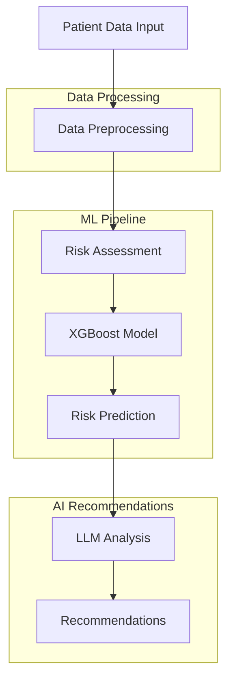

<div align="center">
  
</div>

# Chronic Disease Risk Predictor 🏥

**An advanced AI-powered tool for predicting chronic disease risks and providing personalized medical recommendations.**

---

## 🌟 Features

- **Risk Prediction**: Utilizes XGBoost model to predict chronic disease risks
- **Interactive UI**: Modern, user-friendly interface built with Streamlit
- **Real-time Analysis**: Instant risk assessment and recommendations
- **AI Recommendations**: Personalized health recommendations using LLM (Together AI)

---

## 🔧 Technology Stack

- **Frontend**: Streamlit (v1.40.2)
- **Backend**: Python 3.9+
- **ML Framework**: XGBoost (v2.1.3)
- **Data Processing**: Pandas (v2.2.3), NumPy (v2.1.3)
- **Model Serialization**: Joblib (v1.4.2)
- **Recommendations**: Together AI Integration (Llama-3.2-3B-Instruct-Turbo)

---

## 🚀 Getting Started

### Prerequisites

Ensure you have:

- Python 3.8+
- pip

### Installation

1. **Clone the repository**:

   ```bash
   git clone https://github.com/ajitonelsonn/chronic_disease_predictor.git
   cd chronic_disease_predictor
   ```

2. **Set up a virtual environment**:

   ```bash
   python -m venv venv
   source venv/bin/activate  # Linux/Mac
   # or
   venv\Scripts\activate     # Windows
   ```

3. **Install dependencies**:

   ```bash
   pip install -r requirements.txt
   ```

4. **Configure API Keys**:  
   Create `.streamlit/secrets.toml` and add your Together AI API key:

   ```toml
   [api_keys]
   togetherapi = "your_api_key_here"
   ```

---

## 🤖 Model Development

Detailed documentation of our model development process can be found in our [Jupyter Notebook](create_model/Chronic_Disease_Risk_Prediction_Model.ipynb) or [Create Model](create_model/).

### Data Processing

- Processed 450,000 patient records with 37.5M entries
- Integrated data from multiple sources:
  - Member demographics
  - Enrollment history
  - Service records
  - Provider information

### Model Selection Process

We evaluated three different models:

| Model         | Accuracy | Precision | Recall | F1-Score |
| ------------- | -------- | --------- | ------ | -------- |
| Random Forest | 74.67%   | 70.41%    | 52.86% | 33762.05 |
| XGBoost       | 81.76%   | 57.59%    | 59.66% | 33762.05 |
| LightGBM      | 77.72%   | 73.18%    | 56.16% | 33762.05 |

### Why XGBoost?

We selected XGBoost as our final model due to:

- Highest accuracy (81.76%)
- Better handling of complex feature relationships
- Efficient prediction time
- Good balance of performance metrics

### Feature Engineering

Key features used in the model:

```python
features = [
    'MEM_GENDER_ENCODED',
    'MEM_RACE_ENCODED',
    'MEM_ETHNICITY_ENCODED',
    'MEM_AGE_NUMERIC',
    'DIAGNOSTIC_CONDITION_CATEGORY_DESC_ENCODED',
    # Disease flags
    'HAS_HYPERTENSION',
    'HAS_DIABETES',
    'HAS_RENAL_FAILURE',
    # ... and more
]
```

### Model Training Process

1. **Data Preparation**

   - Feature encoding
   - Handling missing values
   - Data normalization

2. **Model Development**

   - Cross-validation
   - Hyperparameter tuning
   - Performance evaluation

3. **Model Optimization**
   - Feature importance analysis
   - Model compression
   - Inference optimization

For detailed implementation and analysis, check our [model development notebook](create_model/Chronic_Disease_Risk_Prediction_Model.ipynb).

---

## 📈 Workflow



---

## 📁 Project Structure

```plaintext
chronic_disease_predictor/
├── .streamlit/
│   ├── config.toml
│   └── secrets.toml
├── create_model/
│   └── Chronic_Disease_Risk_Prediction_Model.ipynb
├── data/
│   └── PRIMARY_CHRONIC_CONDITION_ROLLUP_DESC.csv
├── model/
│   ├── best_chronic_disease_model.joblib
│   ├── feature_scaler.joblib
│   └── label_encoder.joblib
├── components.py
├── model_utils.py
├── recommend.py
├── streamlit_app.py
├── styles.py
├── utils.py
└── requirements.txt
```

---

## 🛠 Development

1. **Start the Streamlit app**:

   ```bash
   streamlit run streamlit_app.py
   ```

2. **Access the app in your browser**:

   Open [http://localhost:8501](http://localhost:8501).

---

## 👥 Author

**Ajito Nelson Lucio da Costa**

[](https://facebook.com/kharu.kharu89/)  
[](https://linkedin.com/in/ajitonelson)

---

<div align="center">

**Built with ❤️ in Timor-Leste 🇹🇱**

</div>
