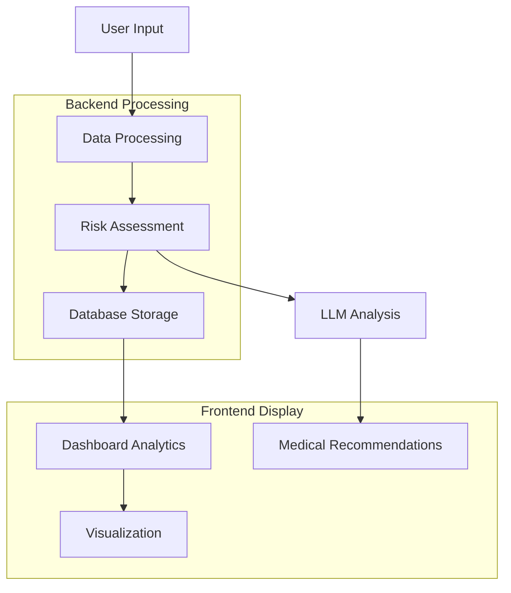

<div align="center">
  
</div>
<p align="center">
  <a href="https://chronicdiseasepredictor.streamlit.app">
    
  </a>
  <a href="https://chronicdiseasepredictor.streamlit.app">
    
  </a>
  <a href="/create_model/Chronic_Disease_Risk_Prediction_Model.ipynb">
    
  </a>
</p>

# [Chronic Disease Risk Predictor 🏥 - Lōkahi Innovation](https://lablab.ai/event/lokahi-innovation-in-healthcare/lafaekai/chronic-disease-risk-predictor)

**An advanced AI-powered healthcare analytics platform for predicting chronic disease risks and providing personalized medical recommendations.**

## 🌟 Key Features

- **Advanced Risk Prediction**: Utilizes XGBoost model with multi-condition analysis
- **Interactive Dashboard**: Real-time analytics and population health insights
- **AI-Powered Recommendations**: Personalized health guidance using Llama 3.2 model
- **Secure Data Management**: MySQL integration for robust data storage
- **Dynamic Visualizations**: Interactive charts and metrics using Plotly
- **Modern UI**: Responsive design with Streamlit components

## 🔧 Technology Stack

### Frontend

- Streamlit (v1.40.2)
- Plotly for interactive visualizations
- Custom CSS styling

### Backend

- Python 3.8+
- MySQL database - [CDRPredictor Database](database/)
- Advanced logging system

### AI/ML Components

- XGBoost for risk prediction
- Together AI (Llama-3.2-3B-Instruct-Turbo) for recommendations
- Scikit-learn for data preprocessing

### Data Processing

- Pandas (v2.2.3)
- NumPy (v2.1.3)
- Joblib (v1.4.2)

## 📊 Dashboard Features

- **Real-time Analytics**: Monitor patient risk levels and trends
- **Population Health Metrics**: Track key health indicators
- **Condition Distribution**: Analyze prevalence of chronic conditions
- **Advanced Filtering**: Customize views by demographics and conditions
- **Interactive Charts**: Dynamic visualization of health trends

## 🚀 Getting Started

### Prerequisites

- Python 3.8+
- MySQL Server - [CDRPredictor Database](database/)
- pip package manager

### Installation

1. **Clone the repository**:

   ```bash
   git clone https://github.com/ajitonelsonn/chronic_disease_predictor.git
   cd chronic_disease_predictor
   ```

2. **Set up a virtual environment**:

   ```bash
   python -m venv venv
   source venv/bin/activate  # Linux/Mac
   # or
   venv\Scripts\activate     # Windows
   ```

3. **Install dependencies**:

   ```bash
   pip install -r requirements.txt
   ```

4. **Configure Environment**:
   Create `.streamlit/secrets.toml`:

   ```toml
   [api_keys]
   togetherapi = "your_together_api_key"

   [database]
   db_host = "your_db_host"
   db_username = "your_db_username"
   db_password = "your_db_password"
   db_name = "your_db_name"
   db_port = "your_db_port"
   ```

## 📁 Project Structure

```plaintext
chronic_disease_predictor/
├── .streamlit/
│   ├── config.toml
│   └── secrets.toml
├── components.py
├── pages/
│   ├── dashboard.py
├── database/
│   └── schema.sql
├── model/
│   ├── best_chronic_disease_model.joblib
│   ├── feature_scaler.joblib
│   └── label_encoder.joblib
├── utils.py
├── styles.py
├── database.py
├── model_utils.py
├── recommend.py
├── streamlit_app.py
└── requirements.txt
```

---

## 🤖 Model Development

<p align="center">
  
  
  
</p>

Detailed documentation of our model development process can be found in our [Jupyter Notebook](create_model/Chronic_Disease_Risk_Prediction_Model.ipynb) or [Create Model](create_model/).

### Data Processing

- Processed 450,000 patient records with 37.5M entries
- Integrated data from multiple sources:
  - Member demographics
  - Enrollment history
  - Service records
  - Provider information

### Model Selection Process

We evaluated three different models:

| Model         | Accuracy | Precision | Recall | F1-Score |
| ------------- | -------- | --------- | ------ | -------- |
| Random Forest | 74.67%   | 70.41%    | 52.86% | 33762.05 |
| XGBoost       | 81.76%   | 57.59%    | 59.66% | 33762.05 |
| LightGBM      | 77.72%   | 73.18%    | 56.16% | 33762.05 |

### Why XGBoost?

We selected XGBoost as our final model due to:

- Highest accuracy (81.76%)
- Better handling of complex feature relationships
- Efficient prediction time
- Good balance of performance metrics

### Feature Engineering

Key features used in the model:

```python
features = [
    'MEM_GENDER_ENCODED',
    'MEM_RACE_ENCODED',
    'MEM_ETHNICITY_ENCODED',
    'MEM_AGE_NUMERIC',
    'DIAGNOSTIC_CONDITION_CATEGORY_DESC_ENCODED',
    # Disease flags
    'HAS_HYPERTENSION',
    'HAS_DIABETES',
    'HAS_RENAL_FAILURE',
    # ... and more
]
```

### Model Training Process

1. **Data Preparation**

   - Feature encoding
   - Handling missing values
   - Data normalization

2. **Model Development**

   - Cross-validation
   - Hyperparameter tuning
   - Performance evaluation

3. **Model Optimization**
   - Feature importance analysis
   - Model compression
   - Inference optimization

For detailed implementation and analysis, check our [model development notebook](create_model/Chronic_Disease_Risk_Prediction_Model.ipynb).

---

## 💻 Application Workflow



## 🔒 Security Features

- Secure database connections
- API key management
- Error logging and monitoring
- Data validation and sanitization

## 📈 Dashboard Analytics

The dashboard provides:

- Risk level distribution trends
- Condition prevalence analysis
- Demographic insights
- Prediction confidence metrics
- Historical data analysis

## 👥 Author

<div align="center">
<strong>Ajito Nelson Lucio da Costa</strong>
</div>

<p align="center">
  <a href="https://facebook.com/kharu.kharu89">
    
  </a>
  <a href="https://linkedin.com/in/ajitonelson">
    
  </a>
</p>

---

<div align="center">
<strong>Built with ❤️ in Timor-Leste 🇹🇱</strong>
</div>
