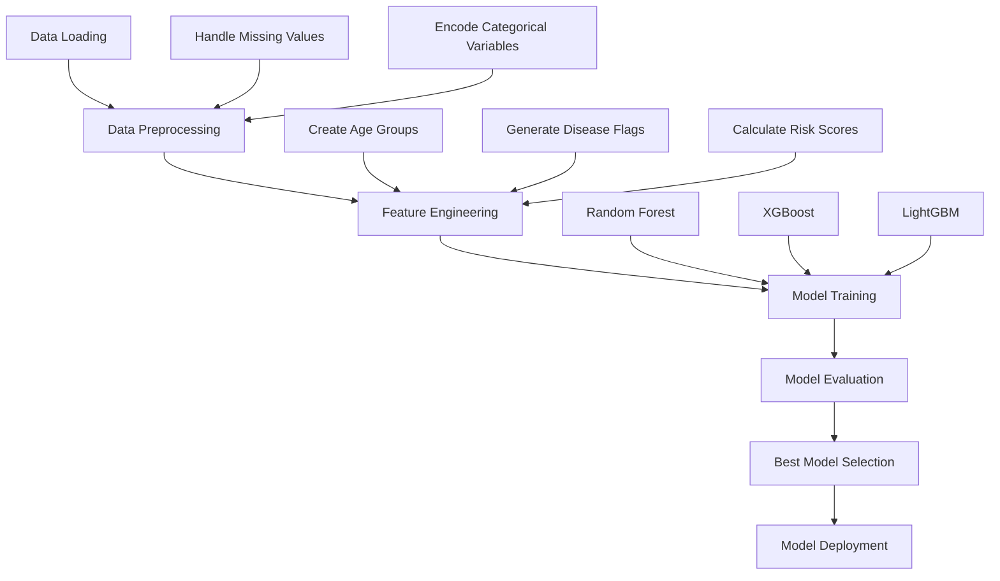

# Chronic Disease Risk Prediction Model

<div align="center">
  
</div>

## Overview

This project implements a machine learning system to predict chronic disease risk based on patient data. It compares three different models (Random Forest, XGBoost with GPU, and LightGBM) to find the most effective approach for disease prediction.

## Technical Stack

- **Python Libraries**: pandas, numpy, scikit-learn, xgboost, lightgbm
- **Visualization**: matplotlib, seaborn
- **Environment**: Google Colab (GPU-enabled)
- **Data Storage**: Google Drive

## Project Workflow



## Features

- Multi-model comparison (Random Forest, XGBoost, LightGBM)
- Comprehensive feature engineering
- Risk score calculation
- Model performance visualization
- Patient-level prediction system

## Dataset Structure

The model uses three main datasets:

1. **Claims_Enrollment**: Patient enrollment and chronic condition data
2. **Claims_Services**: Medical service history
3. **Claims_Member**: Demographic information

## Feature Engineering Process

1. **Basic Features**

   - Demographic information (age, gender, race, ethnicity)
   - Medical service settings
   - Diagnostic conditions

2. **Advanced Features**

   - Age groups
   - Disease combination flags
   - Risk score calculations
   - Age-condition interactions

3. **Risk Categories**
   - Low
   - Moderate
   - High
   - Very High

## Model Training and Evaluation

The notebook implements a comprehensive model training pipeline:

1. **Data Preparation**

   - Feature scaling
   - Train-test split
   - Class weight balancing

2. **Model Training**

   - Random Forest Classifier
   - XGBoost with GPU acceleration
   - LightGBM with GPU acceleration

3. **Evaluation Metrics**
   - Accuracy
   - Precision
   - Recall
   - F1-Score
   - ROC-AUC

## Prediction System

The system provides:

- Individual patient risk assessment
- Top 3 most likely conditions
- Confidence scores
- Patient risk profiles

## Usage

```python
# Load required libraries
import pandas as pd
import numpy as np
from sklearn.ensemble import RandomForestClassifier
from xgboost import XGBClassifier
import lightgbm as lgb

# Load the model
loaded_model = joblib.load('best_chronic_disease_model.joblib')
loaded_scaler = joblib.load('feature_scaler.joblib')
loaded_label_encoder = joblib.load('label_encoder.joblib')

# Make predictions
predictions = predict_patient_condition(patient_data)
```

## Model Performance

The notebook compares the performance of three models:

- Random Forest
- XGBoost with GPU
- LightGBM

Performance metrics include:

- Overall accuracy
- Class-specific precision and recall
- Feature importance analysis
- Confusion matrices

## Author

Developed by **Ajito Nelson Lucio da Costa** as part of the **Lokahi Innovation in Healthcare Hackathon**.

## Connect with Me

[](https://facebook.com/kharu.kharu89/)
[](https://linkedin.com/in/ajitonelson)

<div align="center">

Built with ❤️ in Timor-Leste 🇹🇱

</div>
