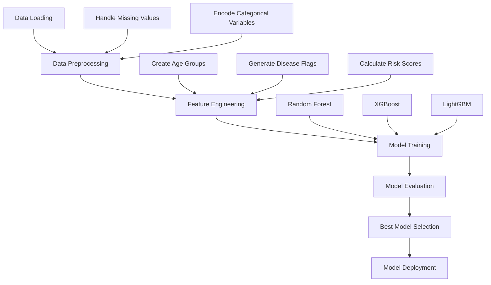
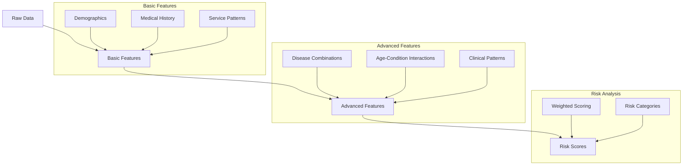

# Chronic Disease Risk Prediction Model

## 🔬 Model Development Process

This repository contains the development of a machine learning system for predicting chronic disease risks using GPU-accelerated model training.

### Dataset Overview

- **Size**: 450,000 patients with 37.5M records
- **Scope**: Data from Hawaii and California
- **Format**: Parquet files (~3.5GB uncompressed)

### Data Integration

Combined four key datasets:

1. **Claims_Enrollment**: Patient enrollment and chronic conditions
2. **Claims_Services**: Medical service history
3. **Claims_Member**: Demographic information
4. **Claims_Provider**: Healthcare provider details

## 🔄 Project Workflow

### Development Pipeline



### Feature Engineering Process



### Model Training Details

Compared three models using A100 GPU acceleration:

| Model         | Accuracy | Precision | Recall | F1-Score |
| ------------- | -------- | --------- | ------ | -------- |
| Random Forest | 74.67%   | 70.41%    | 52.86% | 33762.05 |
| XGBoost       | 81.76%   | 57.59%    | 59.66% | 33762.05 |
| LightGBM      | 77.72%   | 73.18%    | 56.16% | 33762.05 |

### XGBoost Configuration (Best Model)

```python
  xgb_model = XGBClassifier(
        n_estimators=300,
        max_depth=10,
        learning_rate=0.01,
        subsample=0.8,
        colsample_bytree=0.8,
        min_child_weight=3,
        scale_pos_weight=1,
        tree_method='gpu_hist',
        predictor='gpu_predictor',
        eval_metric=['mlogloss', 'merror'],
        objective='multi:softprob',
        random_state=42
    )
```

### Key Features Used

1. **Demographic Features**

   - Age, gender, race, ethnicity
   - Geographic location
   - Insurance type

2. **Clinical Indicators**

   - Existing conditions
   - Service history
   - Diagnostic codes

3. **Derived Features**
   - Disease combinations
   - Risk scores
   - Age-condition interactions

### Model Output

The model provides:

- Primary condition prediction
- Confidence scores
- Top 3 most likely conditions
- Risk level assessment

## 🛠 Development Environment

- **Google Colab**: High-RAM runtime with A100 GPU
- **Storage**: Google Drive integration

## 👥 Author

Ajito Nelson Lucio da Costa

[](https://facebook.com/kharu.kharu89/)
[](https://linkedin.com/in/ajitonelson)

<div align="center">

Built with ❤️ in Timor-Leste 🇹🇱

</div>
