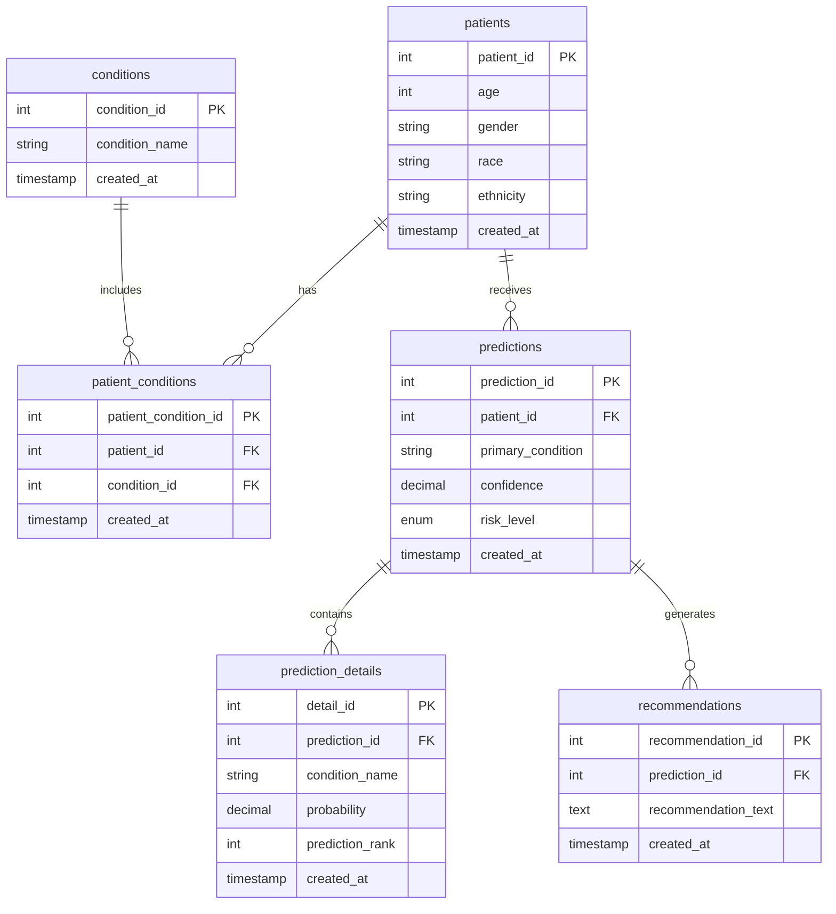

# Chronic Disease Predictor Database

## Overview

This database schema supports the Chronic Disease Risk Predictor application, storing patient information, medical conditions, predictions, and AI-generated recommendations. The schema is designed to maintain data integrity while enabling efficient querying and analysis of patient health data.

## Database Schema

### Entity Relationship Diagram



## Tables Description

### 1. `patients`

- Primary patient demographic information
- Fields:
  - `patient_id`: Unique identifier (AUTO_INCREMENT)
  - `age`: Patient's age
  - `gender`: Patient's gender
  - `race`: Patient's race
  - `ethnicity`: Patient's ethnicity
  - `created_at`: Record creation timestamp

### 2. `conditions`

- Master list of medical conditions
- Fields:
  - `condition_id`: Unique identifier (AUTO_INCREMENT)
  - `condition_name`: Name of the condition (UNIQUE)
  - `created_at`: Record creation timestamp

### 3. `patient_conditions`

- Many-to-many relationship between patients and conditions
- Fields:
  - `patient_condition_id`: Unique identifier (AUTO_INCREMENT)
  - `patient_id`: Reference to patients table
  - `condition_id`: Reference to conditions table
  - `created_at`: Record creation timestamp

### 4. `predictions`

- Stores model predictions for patients
- Fields:
  - `prediction_id`: Unique identifier (AUTO_INCREMENT)
  - `patient_id`: Reference to patients table
  - `primary_condition`: Predicted primary condition
  - `confidence`: Prediction confidence (0-100)
  - `risk_level`: Enum ('Low', 'Medium', 'High')
  - `created_at`: Record creation timestamp

### 5. `prediction_details`

- Stores top 3 predictions for each assessment
- Fields:
  - `detail_id`: Unique identifier (AUTO_INCREMENT)
  - `prediction_id`: Reference to predictions table
  - `condition_name`: Predicted condition name
  - `probability`: Prediction probability (0-100)
  - `prediction_rank`: Rank of prediction (1-3)
  - `created_at`: Record creation timestamp

### 6. `recommendations`

- Stores AI-generated medical recommendations
- Fields:
  - `recommendation_id`: Unique identifier (AUTO_INCREMENT)
  - `prediction_id`: Reference to predictions table
  - `recommendation_text`: LLM-generated recommendation
  - `created_at`: Record creation timestamp

## Setup Instructions

1. Create the database:

```bash
mysql -u root -p < database_setup.sql
```

2. Verify installation:

```sql
USE chronic_disease_predictor;
SHOW TABLES;
```

3. Check initial conditions:

```sql
SELECT * FROM conditions;
```
